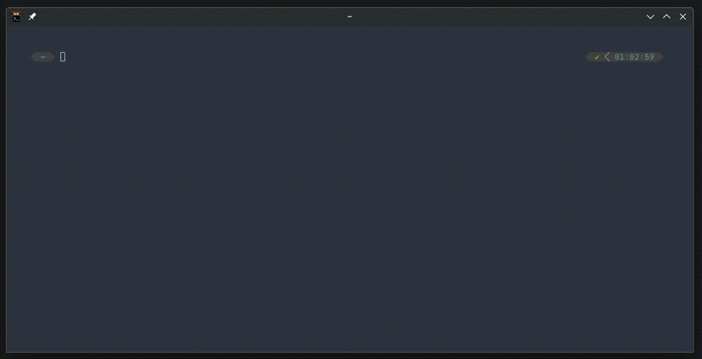

# Liz Shortcut Helper

A Rust-based helper for those who can not remember all the shortcuts (especially those rarely used ones), which supports:

 - Show shortcuts with great filtering function based on [Rofi](https://github.com/davatorium/rofi/)

 - Automatically execute the selected shortcut using [ydotool](https://github.com/ReimuNotMoe/ydotool)

 - Customize the shortcuts and add whatever shortcut or command you want, see examples in [examples.json](./data/sheets/examples.json).

The project name is inspired by a great animation named "Liz and the Blue bird".



# Quick Start

## Installation

### Building from source 

Fist please make sure `rustc` and `cargo` already installed for building this project. For Arch user, you can use `sudo pacman -Sy rust` to install both.

> If you want to further develop or modify the code, recommand to install [rustup](https://rustup.rs/) instead. See [this tutorial](https://wiki.archlinux.org/title/Rust#Installation).

```bash
# Clone this project
git clone git@github.com:philia897/liz-shortcut-helper.git

# cd into it and run command to build it:
cd liz-shortcut-helper && cargo build --release

# Run the command to install it:
./scripts/build_package.sh release && cd release && ./install.sh

# Clean up
rm -rf release/ release.tar.gz

```

## How to use

```bash
# Show all shortcuts by rofi, then autorun the selected shortcut
liz
# or
liz run


# cd to the dir where user can customize the shortcuts following the examples.
cd ~/.config/liz/sheets/
# or cd to the "user_sheets_path" defined in ~/.config/liz/rhythm.toml


# Reload all the sheets inside the given dir, use this when the sheets are modified
liz reload path/to/sheets
liz reload # use default sheets path: /home/{whoami}/.config/liz/sheets

```

# Project Structure

 - **Liz**: The girl sending command to the daemon for execution, and show the results from Bluebird.

 - **Bluebird**: The cute blue bird always waiting in the background and responding to the command from Liz.

 - **andthe**: Define the communication methods between Liz and Bluebird.

# Credits & License

 - Thanks to the wonderful projects [Rofi](https://github.com/davatorium/rofi/) and [ydotool](https://github.com/ReimuNotMoe/ydotool), which make this project possible.

 - License: [GPL-3.0](./LICENSE)